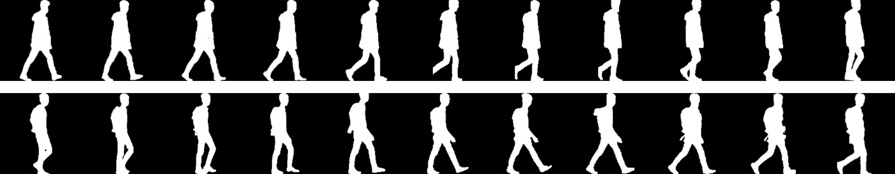

# Code example for Human Identification at a Distance 2020 (HID2020)



## Overview

This code example is made for [HID2020 Competition](http://hid2020.iapr-tc4.org/). The goal of the competition is to provide an evaluation for state-of-the-arts on human identification at a distance (HID). The competition and workshop is endorsed by [IAPR Technical Committee on Biometrics (TC4)](http://iapr-tc4.org/). The workshop will be hosted in conjunction with the Asian Conference on Computer Vision [(ACCV 2020)](http://accv2020.kyoto/) from Nov 30 – Dec 4, 2020.


### How to train you own recognition model?

1. Set you own model struture in ```models/model.py``` and ```models/model_factor.py```.

2. Configure model training config, the default config file is ```./config/baseline_config.yml```.

3. Run code:
```bash
bash train.sh
```

### How to test and generate a submission.csv?
Configure the model used for the test and the path of ```SampleSubmission.csv``` file. 

Run code :
```bash
bash test.sh
```
```./config/baseline_config.yml``` can achieve about 20% accuracy. 

And the output file is ```submission.csv```. **BEFORE** you submit it to [CodaLab](https://competitions.codalab.org/competitions/26085), make sure you compress it into a zip file.


# Citation
The code model refers to the following article. Please cite this paper in your publications if it helps your research:


> @article{zhang2019comprehensive,
> title={A comprehensive study on gait biometrics using a joint CNN-based method},
>  author={Zhang, Yuqi and Huang, Yongzhen and Wang, Liang and Yu, Shiqi},
>  journal={Pattern Recognition},
>  volume={93},
>  pages={228--236},
>  year={2019},
>  publisher={Elsevier}
> }
